# Alarm Clock (24 Hour Format)

Welcome to pure HTML, CSS and Javacript alarm clock (24 hour format).

 

This alarm clock is basically designed for all the basic features like running digital clock face that shows the user's current time and date information on the display panel and the main purpose is to set an alarm where user is able to select a time for the alarm to go on and can delete the alarm.

When the set alarm time is reached, the app plays an audible alarm sound as well as displaying visual information in the display panel. 

 

Below is the image provided for the reference that how Alarm Clock looks like:

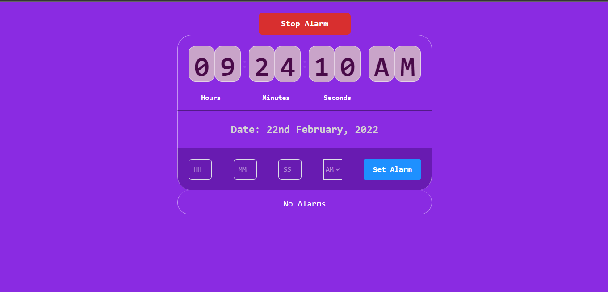

## <ins>Functionalities</ins>
 

- ### <ins>Setting an alarm</ins>
     

    1. Fill the all **four** required fields i.e, **HH** input filed, **MM** input filed, **SS** input filed, **AM/PM** input filed.

    2. Now, click on the **Set Alarm** button. Great! you have set your first alarm. 

     

    **Note:** **HH** input filed, **MM** input filed, **SS** input filed, **AM/PM** input filed all are **mandatory** required fields.

     

    Below is the image provided for the reference of setting an alarm:

    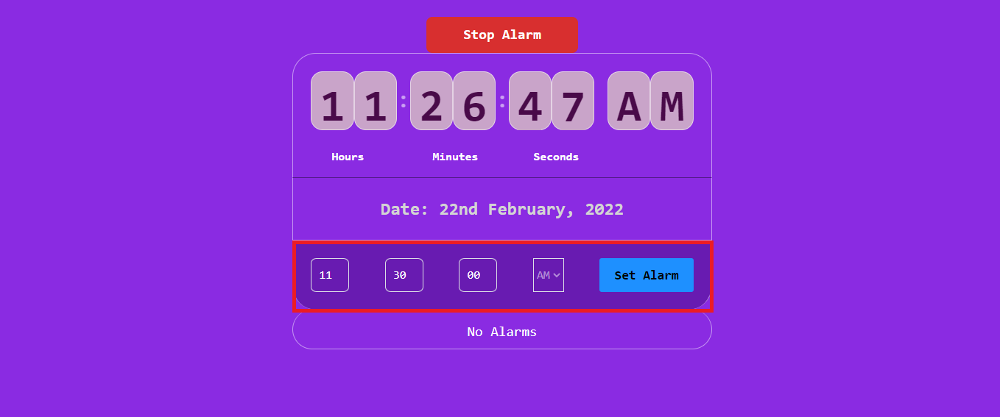

     

- ### <ins>Display all alarms</ins>
     

    1. After clicking the **Set Alarm** button user can see the alarm lists which they have created.

     

    Below is the image provided for the reference of displaying all alarms created by the user:

    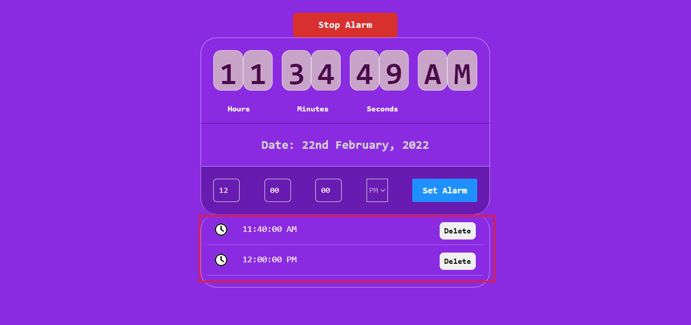

     

- ### <ins>Stop an alarm </ins>
     

    1. When the alarm time is reached and clock started to produce an alarm sound. User can **stop** the alarm by pressing the **Stop Alarm** button.

     

    Below is the image provided for the reference of how to stop an alarm:

    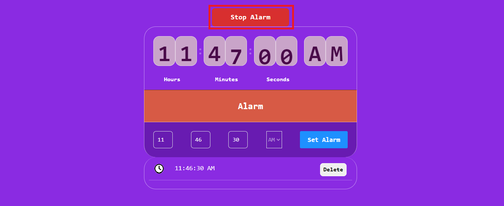

     

- ### <ins>Deleting an alarm </ins>
     

    1. To delete an alarm, click on **Delete** button on the right side of each alarm in the list of all alarms.

     

    Below is the image provided for the reference of how to delete an alarm:

    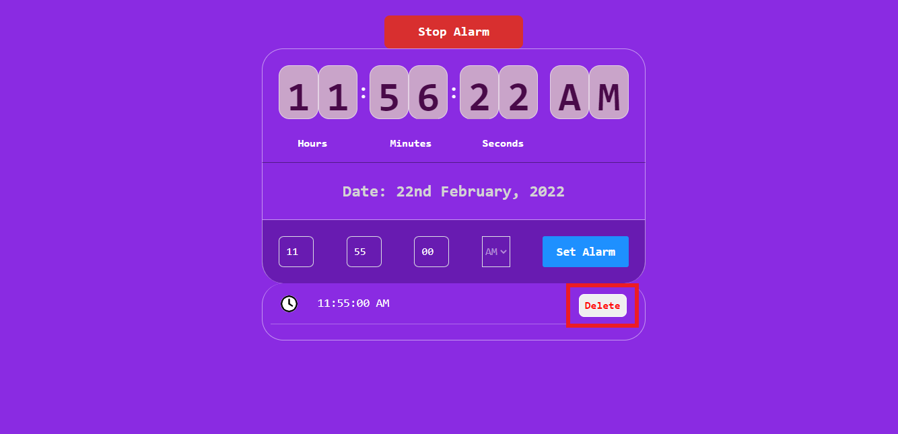

     

## Information displayed on display panel
 

1. ### <ins>Please fill all the required fields:</ins> 
 

   - This **message** is displayed on the display panel when the user has **not** provided any **one or more** of the required input fields. 

    

   Reference image provided below:

   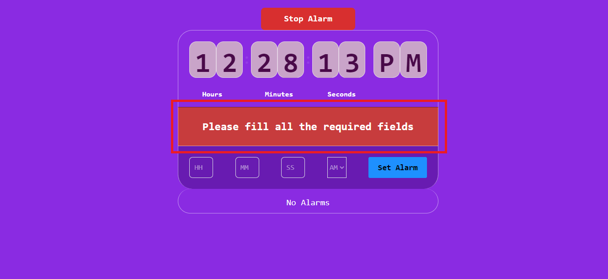

 

2. ### <ins>Invalid Hour Input:</ins> 
 

   - This **message** is displayed on the display panel when the user has provided invalid **HH** input field i.e **input value > 23** (because of 24 hour format).
   - Input value should be in the range of (**0 - 23**).

    

   Reference image provided below:

   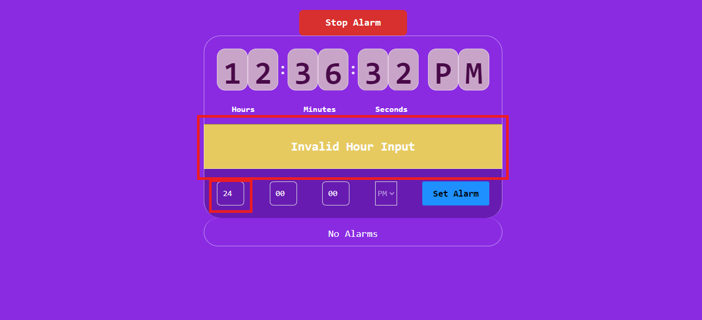

 

3. ### <ins>Invalid Minutes Input:</ins> 
 

   - This **message** is displayed on the display panel when the user has provided invalid **MM** input field i.e **input value > 59** (because of 24 hour format).
   - Input value should be in the range of (**0 - 59**).

    

   Reference image provided below:

   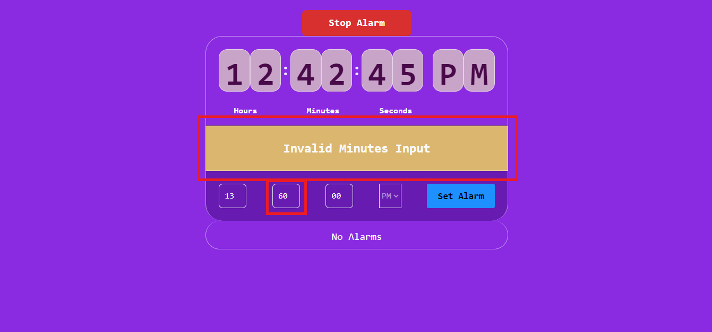

 

4. ### <ins>Invalid Seconds Input:</ins> 
 

   - This **message** is displayed on the display panel when the user has provided invalid **SS** input field i.e **input value > 59** (because of 24 hour format).
   - Input value should be in the range of (**0 - 59**).

    

   Reference image provided below:

   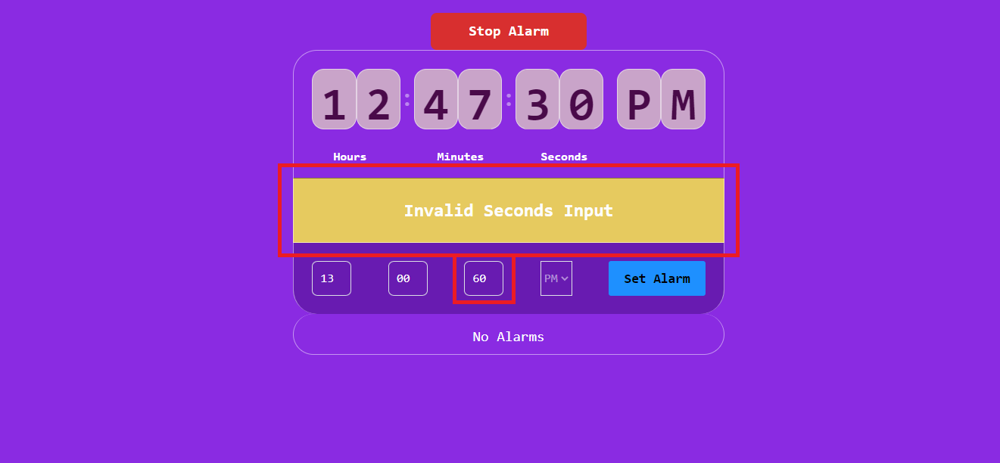

 

5. ### <ins>Alarm Added:</ins> 
 

   - This **message** is displayed on the display panel when the user has **successfully set an alarm**.

    

   Reference image provided below:

   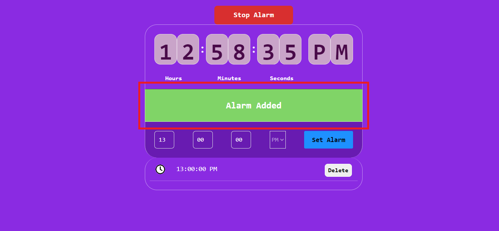

 

6. ### <ins>Alarm Already Exists:</ins> 
 

   - This **message** is displayed on the display panel when the user try to **create an already existing alarm time**. 

    

   Reference image provided below:

   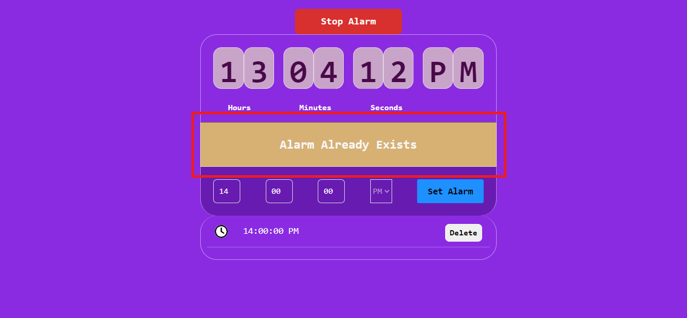

 

7. ### <ins>Alarm:</ins> 
 

   - This **message** is displayed on the display panel when **alarm time is reached and starts a beep sound**.
    

   Reference image provided below:

   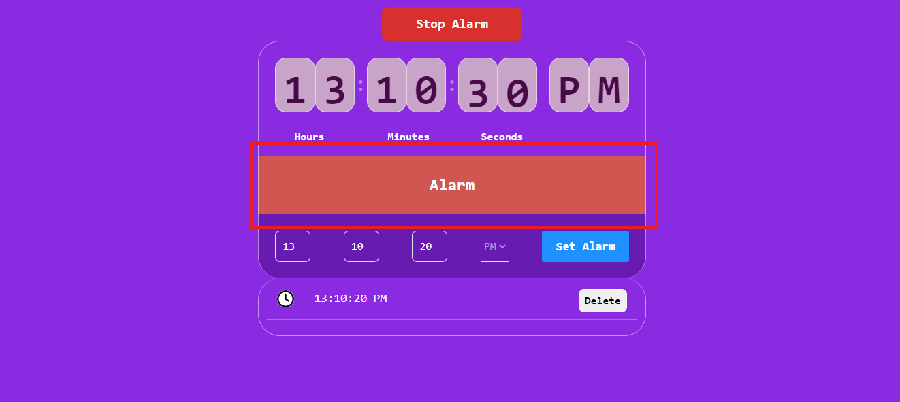

 